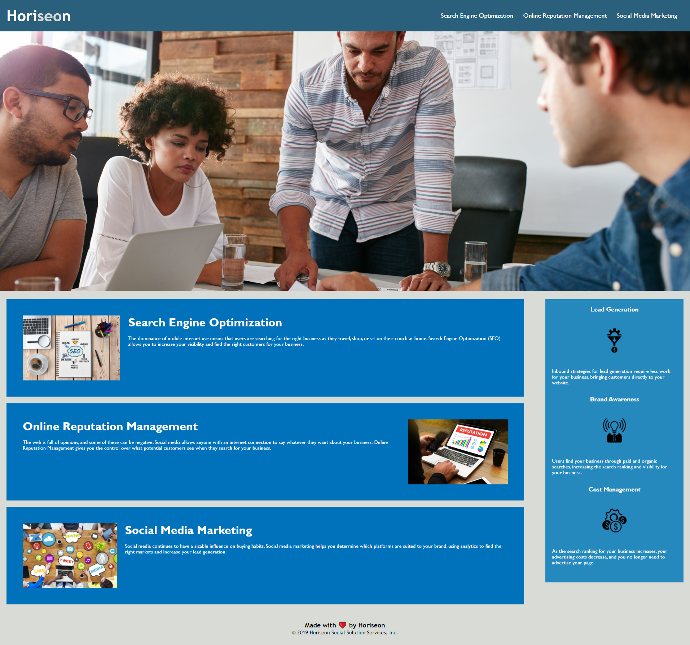

# Horiseon-SEO Code Refactor

## Refactor of the Horiseon web page to follow accessibility standards and optimize for search engines.

### User Story

```
AS A marketing agency
I WANT a codebase that follows accessibility standards
SO THAT our own site is optimized for search engines
```

### Acceptance Criteria

```
GIVEN a webpage meets accessibility standards
WHEN I view the source code
THEN I find semantic HTML elements
WHEN I view the structure of the HTML elements
THEN I find that the elements follow a logical structure independent of styling and positioning
WHEN I view the image elements
THEN I find accessible alt attributes
WHEN I view the heading attributes
THEN they fall in sequential order
WHEN I view the title element
THEN I find a concise, descriptive title
```

### Changes Made to Initial Code

- Made page title more descriptive
- Made some HTML elements more symantic
- Gave header navigation functionality
- Added alt descriptions for all images
- Consolidated and re-organized CSS to follow page structure
- Commented HTMl and CSS for readibility 

### Screenshot of Work


### Deployed Page

https://peter-izzo.github.io/Horiseon-SEO/.
